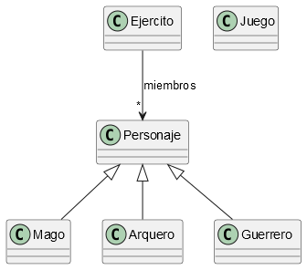

# T02.2-Juego
**Autores:** Toñi Reina

**Revisores:**

Se quiere implementar un esqueleto de un juego de ordenador en el que se tienen distintos personajes. Todos los personajes tienen un **nivel**, que es un entero que representa el nivel del personaje, y un número de vidas, otro entero que registra el número de vidas del personaje. Una vez creado un personaje, solo se pueden modificar la propiedad número de vidas a traves de las operaciones `perderVida`, que decrementa en uno el número de vidas del personaje,.y `vidasExtra`, que añade un número de vidas dado a las vidas del personaje. El número de vidas no puede ser negativo. Todos los personajes tienen un método `atacar` que muestra por consola el tipo de ataque que puede hacer el personaje.

En el juego hay tres tipos de personajes: guerreros, magos y arqueros. Un *Guerrero*, además de las propiedades de todos los personajes, tiene una propiedad de tipo entero que representa la *fuerza* que tiene el personaje. Un *Mago*, además de la propiedades comunes al resto de personajes, tiene una propiedad de tipo entero *maná*, que representa la energía necesaria para lanzar hechizos. Finalmente, un *Arquero*, tiene, además de las comunes, una propiedad de tipo entero *precisión*, que indica la precisión con la que el arquero dispara las flechas. Las propiedades específicas de lso tipos de personajes solo se pueden consultar.

Se considera que dos personajes son iguales si todas sus propiedades son iguales.

Los personajes se agrupan en ejércitos. Cada `Ejercito` que tiene un nombre, y una lista de miembros. Los miembros son los personajes que forman parte del ejército. Un Ejército se construye a partir de su nombre, e inicialmente no tendrá miembros. Los miembros se agregarán al ejército con una operación `agregarMiembro`, que toma a un personaje y lo añade al ejército. Si el personaje ya estaba en el ejército, no hace nada. La representación de un ejercito es la lista de todos sus miembros. Los ejércitos cuentan también con una operación `atacarTodos` que hace que todos los miembros del ejército entren en la batalla atacando. Solo se podrán consultar el nombre y el número de miembros del ejército. 

Se considera que dos ejércitos son iguales si tienen el mismo nombre y los mismos miembros.

La siguiente figura muestra un diagrama de clases UML con un esquema de las clases involucradas en el proyecto.



Se pide: 

1. En el paquete `fp.juego`cree una clase para cada uno de los tipos de personajes descritos anteriormente, reutilizando mediante herencia el código de la clase `Personaje`.
2. En el paquete `fp.juego` cree una clase `Juego` que tenga un método `main`. En el método `main` cree los tres personajes cuyos datos se muestran a continuación. Muestre la representación como cadena de cada uno de los objetos y a continuación invoque a sus respectivos métodos para atacar, la salida por consola debe ser similar a la siguiente:

```
Guerrero: nombre=Arthur, nivel=10, numVidas=100, fuerza=80
Arthur ataca con su espada con fuerza 80!
Mago: nombre=Merlin, nivel=12, numVidas=80, mana=120
Merlin lanza un hechizo usando 120 de maná!
Arquero: nombre=Robin, nivel=11, numVidas=90, precision=95
Robin dispara una flecha con precisión de 95!
```

3. En el paquete `fp.juego` cree la clase `Ejercito`
4. Cree en el método main de la clase `Juego` un ejército y añada al mismo a los tres personajes creados anteriormente. Muestre la representación como cadena del ejército, y luego invoque a la operación `atacarTodos`. La salida por la consola de estas tres operaciones debe ser similar a la que se muestra a continuación:

```
Ejercito EjercitoFP:3 miembros
	Guerrero: nombre=Arthur, nivel=10, numVidas=100, fuerza=80
	Mago: nombre=Merlin, nivel=12, numVidas=80, mana=120
	Arquero: nombre=Robin, nivel=11, numVidas=90, precision=95

🔥 ¡El ejército EjercitoFP entra en batalla! 🔥
Arthur ataca con su espada con fuerza 80!
Merlin lanza un hechizo usando 120 de maná!
Robin dispara una flecha con precisión de 95!
```
